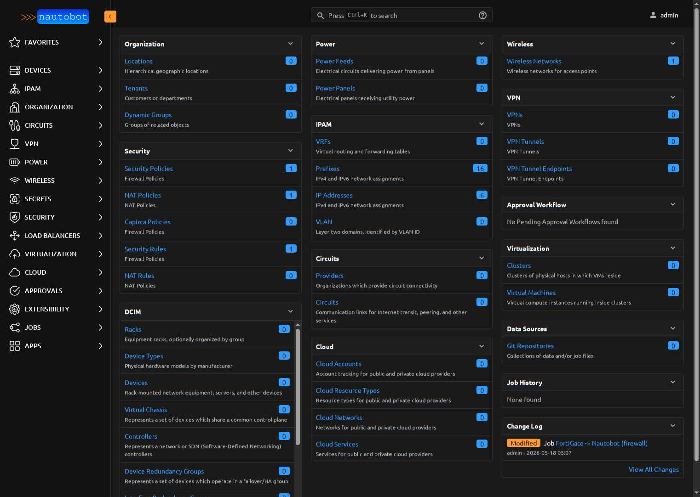
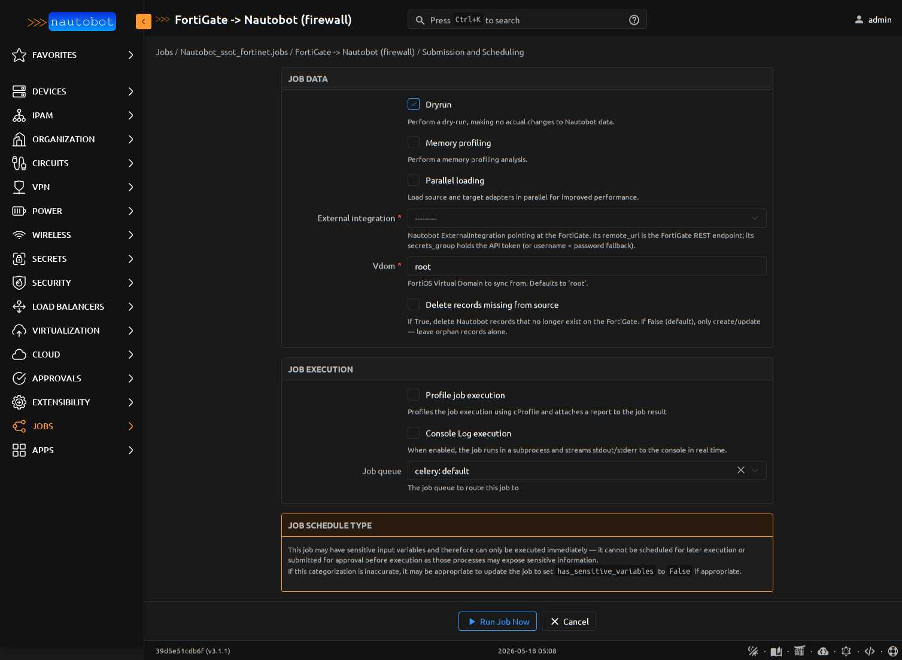

# Getting Started with the App

If you just want to sync a FortiGate into Nautobot in 10 minutes, this is for you.

## What you'll have at the end

After running the first sync, Nautobot's home dashboard will show synced
counts in the **Security**, **Wireless**, and **IPAM** panels — pulled
live from your FortiGate:



(Real screenshot from the dev stack — synced against a FortiWiFi-61E.)

## What you need before starting

- A Nautobot instance with the integration installed
  (see [`../admin/install.md`](../admin/install.md))
- A FortiGate with REST API access
- The IP address and an admin API token (or username + password) for the FortiGate

## Step 1 — Create credentials in Nautobot

In Nautobot's UI:

1. **Secrets → Secrets → Add** → create a Secret named e.g.
   `fgt-edge1 API token`, provider `environment-variable`, parameters
   `{"variable": "FGT_EDGE1_TOKEN"}`.
2. **Secrets → Secrets Groups → Add** → create a SecretsGroup named
   `fgt-edge1 creds`, add the Secret above with
   `Access Type=Generic, Secret Type=Token`.

Set the env var on the Nautobot worker:

```bash
export FGT_EDGE1_TOKEN="<your token>"
sudo systemctl restart nautobot-worker
```

## Step 2 — Create the ExternalIntegration

**Extensibility → External Integrations → Add**:

- **Name**: `fgt-edge1` (this name will prefix all synced object names)
- **Remote URL**: `https://10.0.0.1` (or your FortiGate's address)
- **Verify SSL**: True (or False for self-signed labs)
- **Timeout**: 30
- **Secrets Group**: select `fgt-edge1 creds`

## Step 3 — Enable + run the firewall pull Job

The integration registers five Jobs visible at **Apps → Single Source of
Truth** (`/plugins/ssot/`) — two pull (data sources) and two push (data
targets) plus a live-status diagnostic Job:


Then:

1. **Extensibility → Jobs** — find **"FortiGate → Nautobot (firewall)"**
   → click the pencil → check **Enabled** → save
2. Click **Run Job** — you'll see the form below:

   

3. Pick `fgt-edge1` from the **External integration** dropdown
4. Leave **Dryrun** checked for the first run — review the diff before
   any data hits Nautobot
5. Click **Run Job Now**

After a few seconds, browse to:
`/plugins/firewall/address-object/?q=fgt-edge1__`

You'll see all your FortiGate addresses, prefixed with `fgt-edge1__root__`.

## Step 4 — Re-run without dry-run

Now run the same Job again, uncheck **Dry run**, click submit. The Job
applies the diff for real. Browse the address-object list again — they
should still be there. Re-running the Job a third time should produce a
diff summary of `create=0, update=0, delete=0`.

## Step 5 — Repeat for wireless

If your FortiGate has wireless config:

1. Enable **"FortiGate → Nautobot (wireless)"**
2. Run it with the same ExternalIntegration
3. Browse `/wireless/wireless-networks/` to see synced SSIDs

## Step 6 — Check who's on your wifi right now

Enable **"FortiGate Live Status"** and run it with the ExternalIntegration.
The Job result page shows a table of connected wifi clients with their
MAC, IP, hostname (joined from DHCP leases), SSID, and data rate. A JSON
snapshot is attached for download.

## Step 7 — Edit-and-push workflow (optional)

If you want Nautobot to drive FortiGate config:

1. In Nautobot UI, edit any synced object:
    - **AddressObject** — change the prefix, description, or rename
    - **PolicyRule** — toggle action, log, or change source/destination
      addresses
    - **NATPolicyRule** — edit the IP value of the synthesized
      `vip_*_mapped` address to redirect a VIP (v2.6+)
2. Enable **"Nautobot → FortiGate (firewall)"** (and/or wireless)
3. Run with the same ExternalIntegration, **Dryrun checked first**
4. Apply when the diff looks correct
5. Verify on the FortiGate web UI that the change landed

Every push CRUD path (create/update/delete) across AddressObject,
AddressObjectGroup, ServiceObject, ServiceObjectGroup, PolicyRule, and
NATPolicyRule has been live-validated end-to-end against a real
FortiGate. See the e2e scripts in `development/scripts/e2e_push_*.py`
for the exact validation patterns.

!!! note "Known FortiOS REST limitation"
    VAP (WirelessNetwork) **delete** via REST is blocked by a FortiOS
    quirk — VAP creates a dependent quarantine interface, and neither
    can be deleted while the other exists. Use the FortiGate web UI's
    VAP delete wizard for VAP removal. Create and update work via push.

## What to do when something looks wrong

See [`../admin/troubleshooting.md`](../admin/troubleshooting.md).
