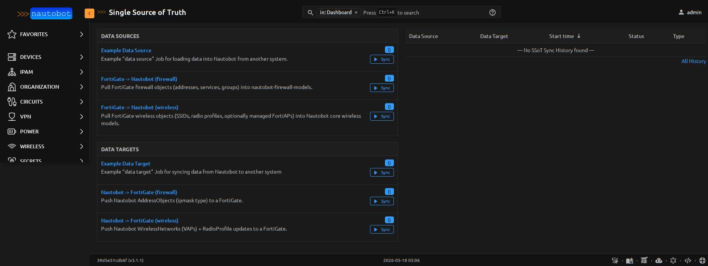

# Using the App

End-to-end scenarios showing how the seven Jobs combine. Pull / push
spans firewall objects, wireless config, NAT VIPs, policies, the
FortiGate-as-Device with its interfaces and IPs, VLAN sub-interfaces,
and static routes.

The integration registers all sync Jobs under one dashboard at
**Apps → Single Source of Truth**:

Pull (Data Sources) and push (Data Targets) directions are visible
side-by-side — each Job is one click to configure and run.

## Use case 1 — Inventory & audit of a fleet of FortiGates

**Goal:** centralize firewall config across many FortiGates into one Nautobot instance for inventory, audit, and cross-device queries.

**Setup:**

1. One `ExternalIntegration` per FortiGate (each name becomes the hostname prefix on synced objects).
2. Enable the **FortiGate → Nautobot (firewall)** Job.
3. Schedule the Job to run periodically via Nautobot's built-in scheduler (e.g., every 6 hours).

**What you get:**

- Browse `/plugins/firewall/address-object/?q=fgt-edge1__` to see every address from a specific device.
- Cross-device queries via GraphQL: `addresses(name_iregex: "WEB_SERVERS$")` finds every "WEB_SERVERS" definition across the fleet.
- SSoT dashboard at `/plugins/ssot/` shows the sync history per device — when, who ran it, the diff summary.
- Drift detection: a non-empty diff on a regularly-scheduled sync means someone changed the FortiGate config outside Nautobot. Worth alerting on.

## Use case 2 — Live wifi observability

**Goal:** see who's connected to a FortiWiFi (or FortiGate-managed FortiAPs) right now, without ssh'ing to the device.

**Setup:**

1. The same `ExternalIntegration` used for sync (no extra credentials needed).
2. Enable the **FortiGate Live Status** Job.
3. Run on-demand from the Nautobot Jobs UI, or schedule for periodic snapshots.

**What you get:**

- Job result page shows a table of currently-associated wifi clients with MAC, IP, hostname (joined from DHCP leases), SSID, data rate, and authentication status.
- A JSON snapshot of the raw `monitor/*` data is attached to each Job result — downloadable for offline analysis.
- Schedule the Job every 5 minutes and Nautobot's Job result history becomes a time-series record of who's been on the wifi.

The Job pulls from three FortiOS monitor endpoints and joins them by MAC:

- `monitor/wifi/client` — associated clients (MAC, SSID, signal, rate)
- `monitor/system/dhcp` — leases (hostname via DHCP VCI option)
- `monitor/network/arp` — MAC↔IP bindings

## Use case 3 — Edit-and-push workflow (Nautobot as source of truth)

**Goal:** operators edit FortiGate config in Nautobot's UI; changes propagate to the FortiGate via REST.

**Setup:**

1. **First**, run the pull Jobs once each to seed Nautobot with the FortiGate's current state. This establishes the baseline so subsequent pushes only sync intentional changes.
2. Enable the relevant push Job(s):
   - **Nautobot → FortiGate (firewall)** — addresses, services, groups, policies, NAT VIPs
   - **Nautobot → FortiGate (wireless)** — VAPs and RadioProfiles
   - **Nautobot → FortiGate (device + interfaces)** (v3.3+) — VLAN sub-interfaces and static routes
3. Edit objects in Nautobot's UI (or via REST/GraphQL):
   - **AddressObject, AddressObjectGroup, ServiceObject, ServiceObjectGroup** — full CRUD
   - **PolicyRule** — full CRUD with `source_interfaces` / `destination_interfaces` structured attrs (parsed from the description's `[srcintf=lan dstintf=wan1]` annotation)
   - **NATPolicyRule** (VIP) — full CRUD; **editing the IP value of an existing `vip_*_mapped` AddressObject propagates** to the FortiGate VIP's mappedip on push (v2.6+)
   - **WirelessNetwork** (VAP) — create + update only (FortiOS REST blocks delete via the quarantine-interface circular dependency)
   - **VLAN sub-interfaces** (`dcim.Interface` with parent_interface + VLAN, v3.3+) — full CRUD; keep names ≤ 15 chars (FortiOS silently truncates)
   - **`FortinetStaticRoute`** (v3.4+, app-owned model at `/plugins/ssot-fortinet/static-routes/`) — full CRUD including named-AddressObject destinations and blackhole routes
4. Run the push Job with the same `ExternalIntegration`. **Use Dryrun first** — review the diff before applying.

**What you get:**

- Edits in Nautobot propagate to the FortiGate via REST.
- Operators get Nautobot's RBAC, change-log, and GraphQL API on top of the firewall config.
- Combined with the pull Job, you can run *both* directions on schedule for full bidirectional reconciliation (caveat: pick which side wins on conflict).
- Every push CRUD operation has a focused e2e test in `development/scripts/e2e_push_*.py` that exercises it end-to-end against a real FortiGate. Run `make -C development e2e-push-all` to validate your push paths after upgrade.

!!! warning
    The push direction enables real config changes on the FortiGate. Always run the push Job in **dry-run mode** first (built-in BooleanVar on every SSoT Job). The dry run computes diffs without applying them so you can review what would change.

## Use case 4 — FortiGate as Nautobot Device (v3.x)

**Goal:** make your FortiGate appear in Nautobot's **Devices** list with its interfaces, IP assignments, VLAN sub-interfaces, and static routes — same as any Nautobot-managed network device. Closes the visibility gap that operators expect from any SSoT integration.

**Setup:**

1. Pre-create Nautobot scoping records (one-time):
   - **Manufacturer**: `Fortinet`
   - **DeviceType**: e.g. `FortiWiFi-61E`, `FortiGate-100F` (one per FortiGate model in your fleet)
   - **Role**: e.g. `Firewall`
   - **Location**: where the FortiGate physically lives
   - **Status**: typically `Active`
2. Enable **FortiGate → Nautobot (device + interfaces)** Job (v3.0+).
3. Run with the same `ExternalIntegration` plus the new DeviceType / Role / Location / Status ObjectVars.

**What you get:**

- The FortiGate appears at `/dcim/devices/` with its real serial (v3.2.5+), location, role, type.
- Every physical / aggregate / hard-switch / switch interface is a `dcim.Interface` on that Device.
- **VLAN sub-interfaces** (v3.1+) sync with their `parent_interface` resolved automatically; the `vlanid` field populates a `ipam.VLAN` record.
- Interface IPs (incl. secondary IPs) sync as `ipam.IPAddress` records assigned to the interface via the M2M.
- **Static routes** (v3.1+) sync to a new app-owned model at `/plugins/ssot-fortinet/static-routes/`. Destinations can be CIDR prefixes OR named AddressObjects (v3.1+). Includes `distance`, `priority`, `blackhole`, and `comment` fields.
- Cross-device GraphQL works: query "all FortiGate interfaces with an IP in `192.0.2.0/24`" across your fleet.

**Skipped on purpose:**

- `vap-switch` interfaces — already represented via the WirelessNetwork sync (Use case 2 setup, but for wireless config not status)
- Auto-quarantine `wqtn.*` VLANs — FortiOS internal artifacts
- Tunnel interfaces — VPN-specific, deferred to a future VPN-focused release

## Use case 5 — Drift detection between Nautobot and FortiGate

**Goal:** detect when the FortiGate has been changed outside Nautobot's UI.

**Setup:**

1. Use Nautobot as source of truth (use case 3 setup).
2. Schedule the **pull** Job to run periodically.
3. Wire Nautobot's webhook system to alert when the pull Job produces a non-empty diff.

**What you get:**

- A non-zero diff on a scheduled pull = drift. The diff summary tells you what changed.
- Combine with the live status Job to attach a wifi-client snapshot to each drift event for context.
- Optional: chain a follow-up push Job that re-asserts Nautobot's view of truth (back into agreement).
